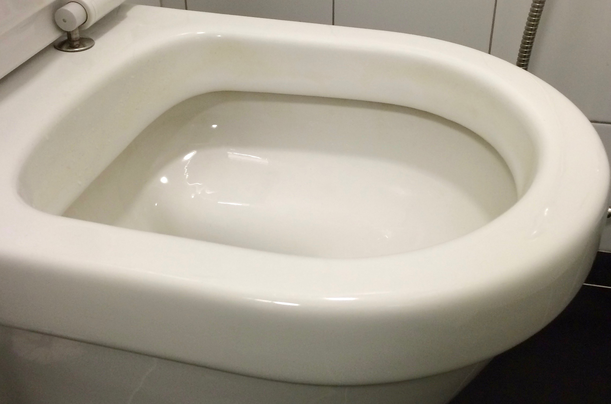
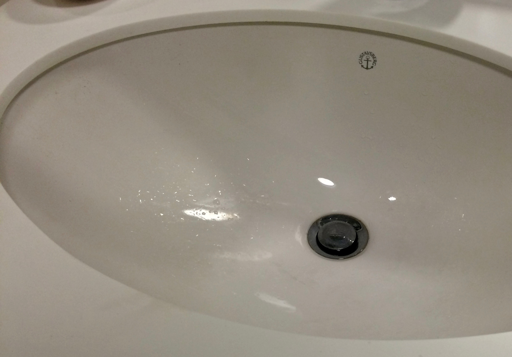

Зимой надо закрывать дверь в туалет и ванную, потому что оттуда идет холод и быстро теряется влажноть в квартире.

### Столешница
Из искусственного камня. Можно протирать всеми видами губок.
Губки находятся в ящике №2 в ванной.

### Керамика
Хорошо моется жесткой стороной губки для мытья или впитывающей губкой. Унитаз можно мыть скребком или жесткой губкой с Cillit Bang.

Унитаз | Умывальник
--- | --- | ---
 | 

### Ванная
Ванная из акрила (пластик) тоже царапается, поэтому мыть мягкой стороной губки. Ванная большая и на нее жалко тратить Cillit Bang, хорошо подходит Fairy.
