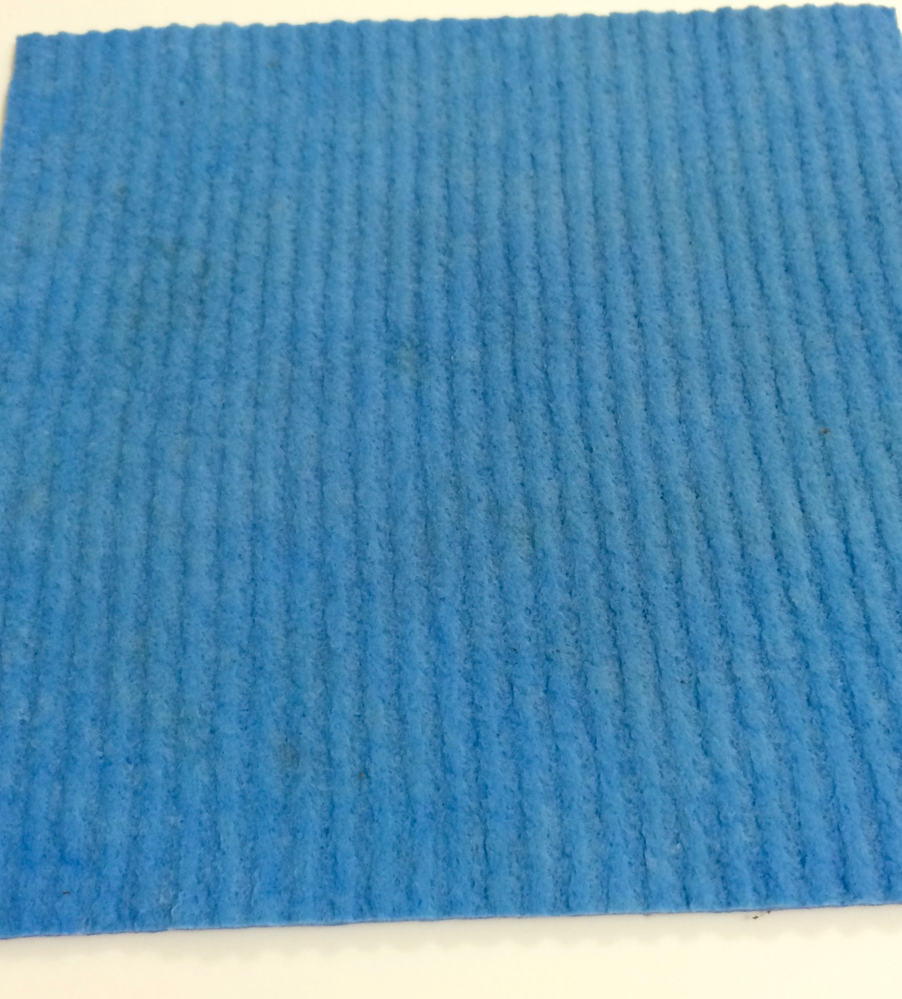
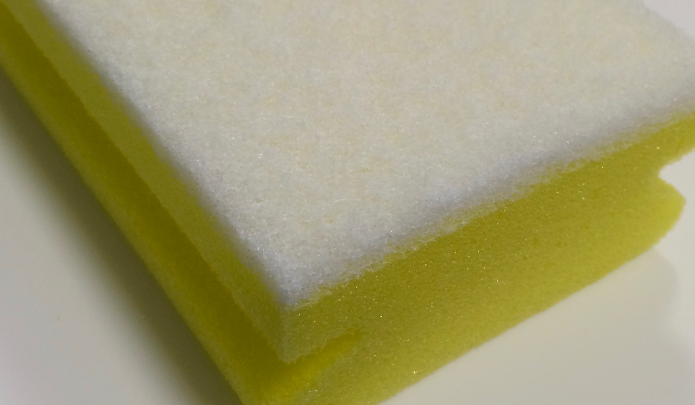
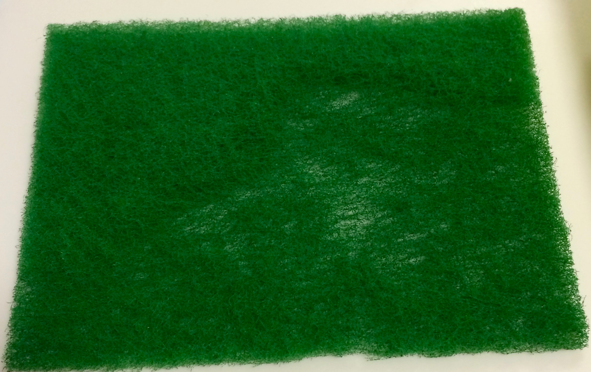

### Моющие принадлежности
Находятся в ящике №1 в ванной:
* Впитывающая салфетка. Хорошо вытирает пыль и впитывает воду.

* Губка для мытья поролоновая (мягкая и жесткая сторона). Жесткой стороной
нельзя протирать хромированные (блестящие) поверхности,
потому что на них остаются царапины.

* Очищающий скребок (для сильно загрязненных поверхностей). Им тоже нельзя
протирать хромированные (блестящие) поверхности.

Впитывающая салфетка | Губка | Скребок
--- | --- | ---
 |  |  
