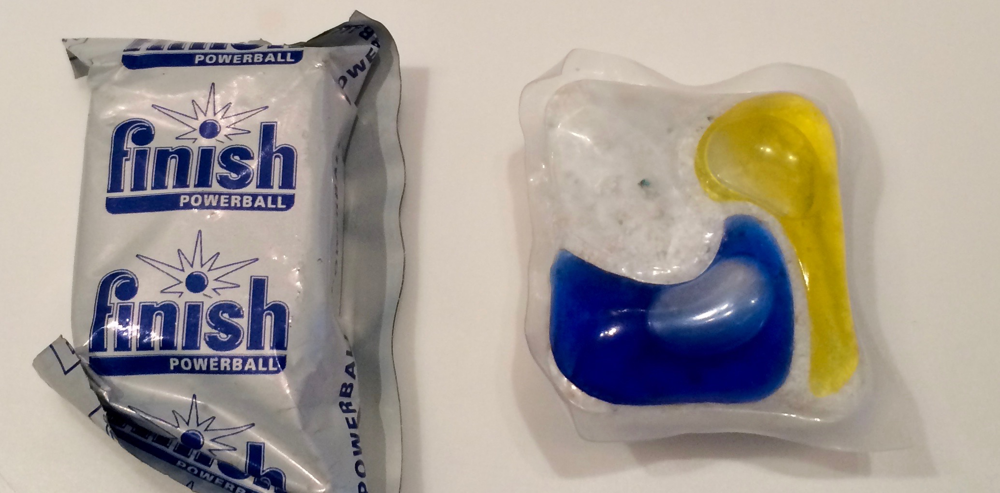

### Посудомойка
Перед изпользованием внимательно изучить инструкцию (находится в ящике №4 в зале).

#### В посудомойке **нельзя** мыть:
* дерево (ножи, кухонные доски, деревянные лопаточки, ложки)
* медь
* конфорки с плиты
* если нет 100% уверенности что это можно мыть в посудомойке, то лучше это не мыть

Посудомойка находится рядом со стеной, которую очень легко испачкать, если размахивать грязной посудой.

Таблетки для посудомойки находятся в ящике №3 в зале.

