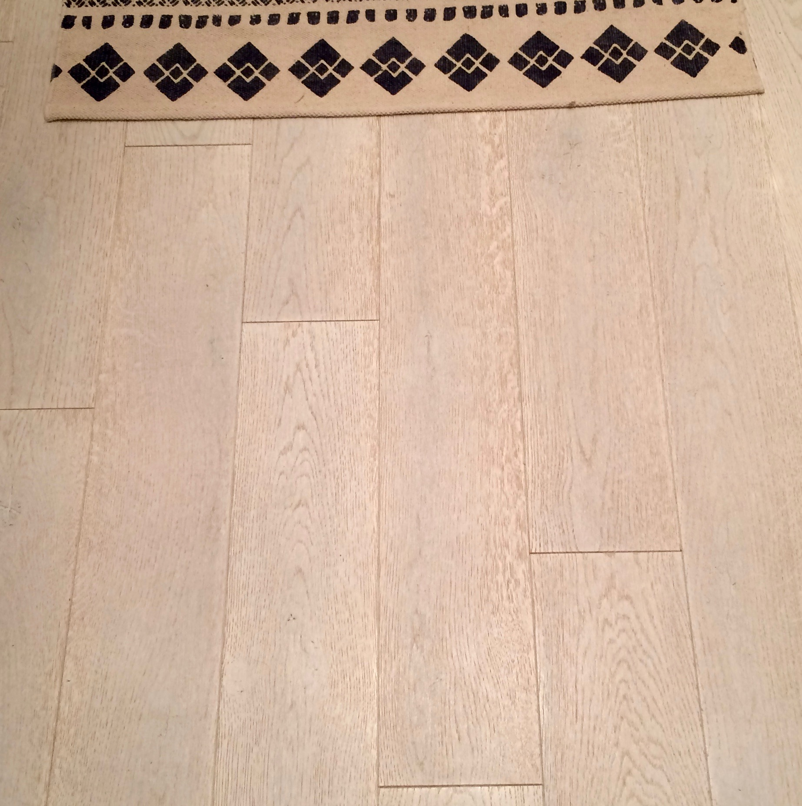
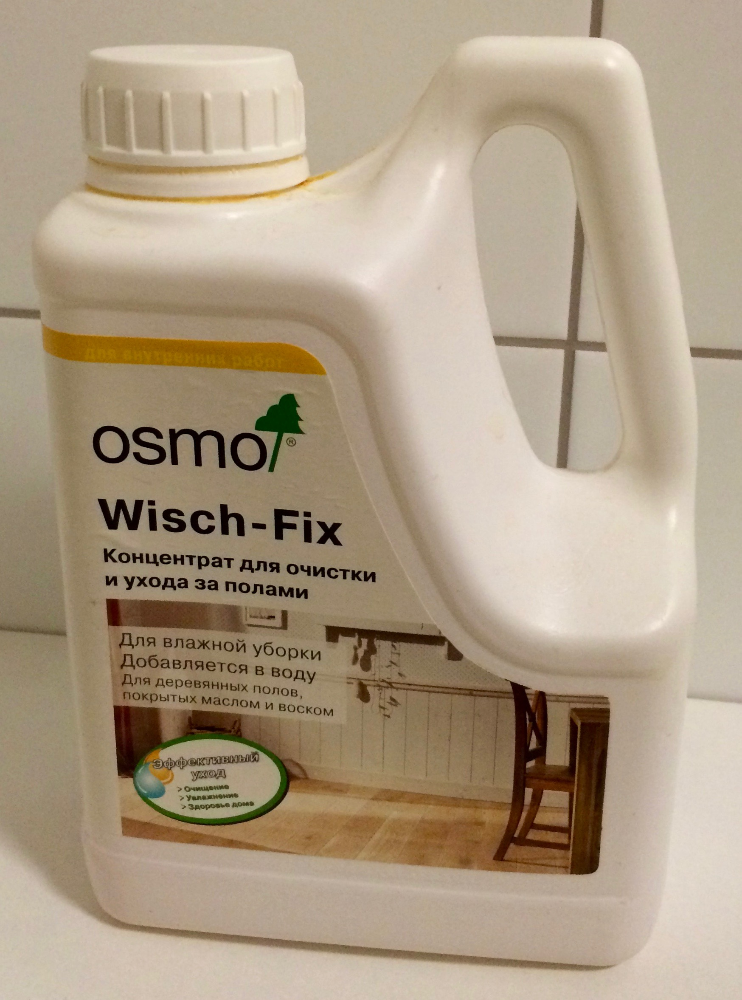

### Пол

Для того, чтобы паркет не рассыхался, зимой в помещении нужно поддерживать влажность не меньше 30%. Влажная уборка хорошо поднимает влажность. Паркет покрыт воском, который легко стирается, поэтому нужно мыть специальным средством:

1. Набрать 5л воды в зеленое пластиковое ведро (ящик №2 в ванной)
2. Набрать 1л воды в зеленый пластиковый тазик (ящик №2 в
   ванной)
3. Взять средсво для паркета Osmofix из ящика №1 в ванной и добавить 1 колпачок средсва в 1л воды в тазике, размешать
4. Вымыть тряпку для пола в зеленом ведре, выкрутить
5. Смочить тряпку в тазике с Osmofix, выкрутить
6. Помыть участок пола
7. Повторить начиная с пункта 4

Паркет | Osmofix
--- | ---
 | 
