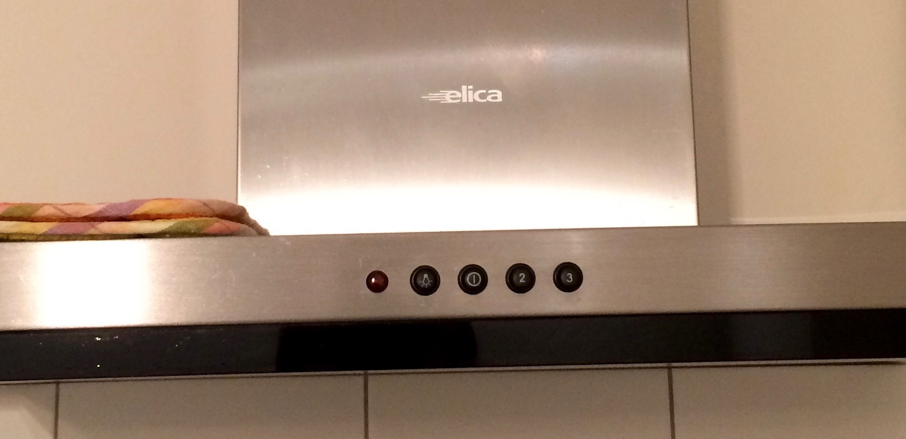
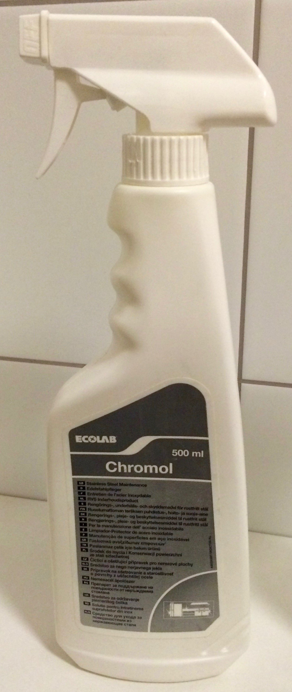

### Вытяжка

Жировой можно мыть в посудомоечной машине. Вытяжку **нельзя** протирать водой или обычными моющими средствами, потому что она сразу покрывается ржавчиной. Для нее есть специальное моющее средство Chromol в ящике №1 в ванной.

Вытяжка | Chromol
--- | ---
 | 
