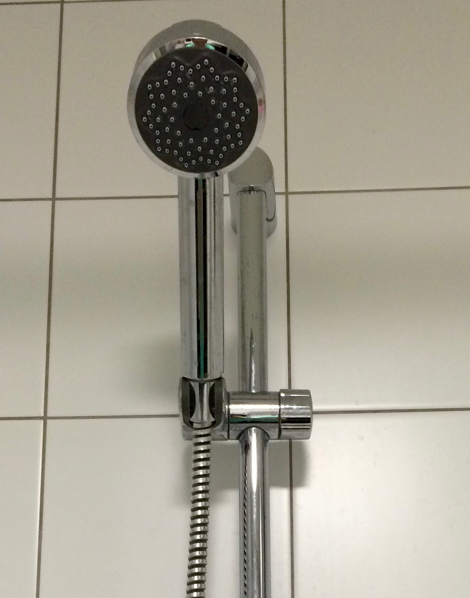
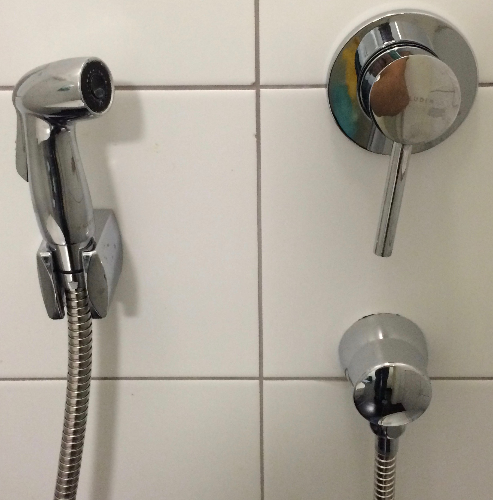
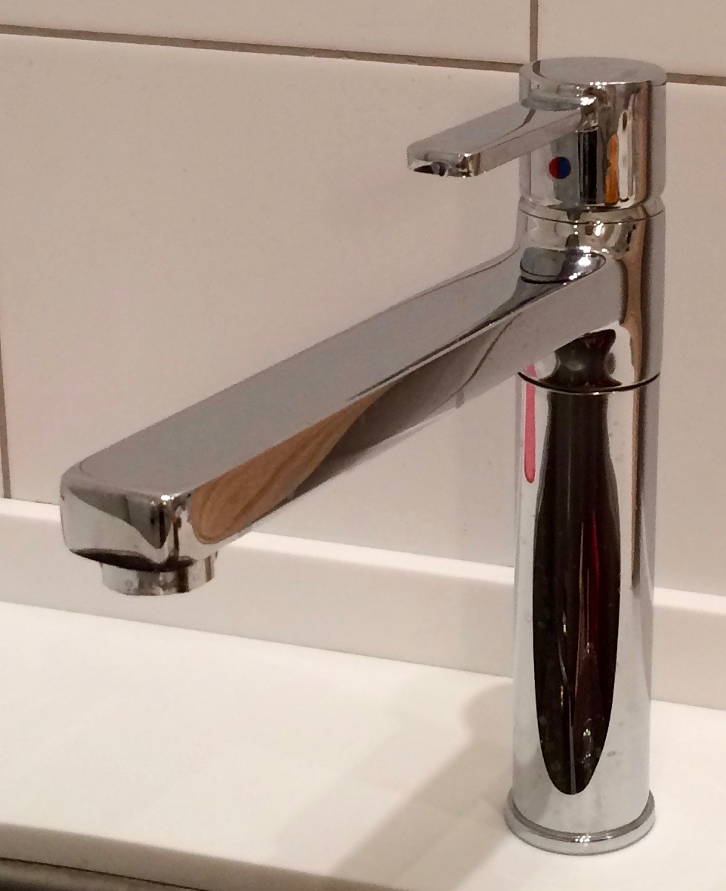
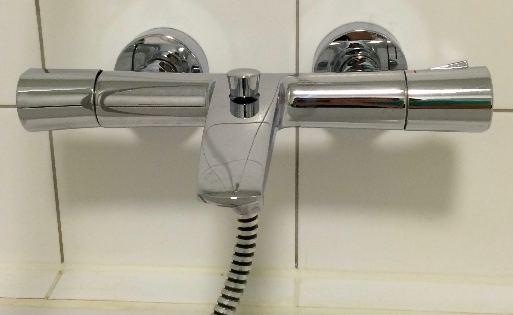
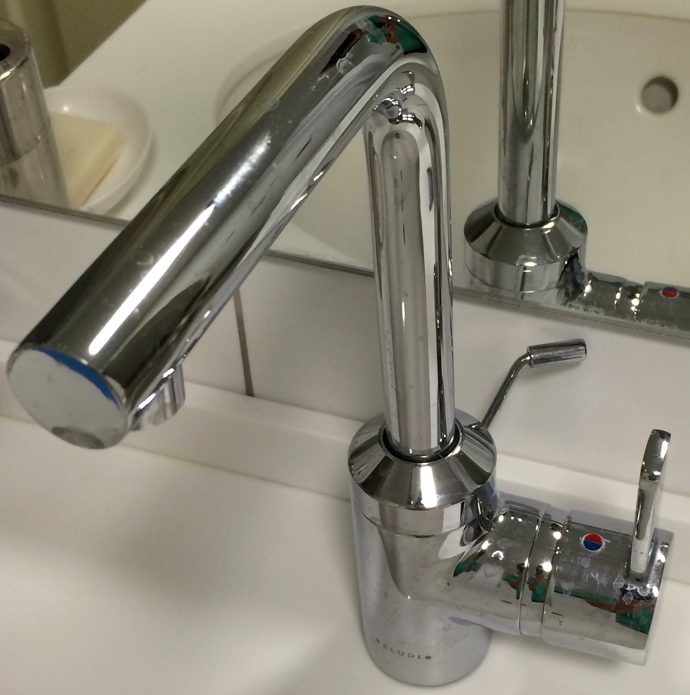

### Смесители
Все смесители хромированные, с блестящей поверхностью. Их **нельзя** протирать жесткой губкой, потому что их легко поцарапать! После использования нужно вытереть брызги и капли воды с поверхности смесителя впитывающей салфеткой. Если этого не сделать, то прийдется чаще удалять известковый налет.

 |  | 
--- | --- | ---
  |  |

> **Известковый налет** удаляется с помощью губки для мытья или впитывающей салфетки (ящик №2 в ванной) и моющего средства Cillit Bang (ящик №1 в ванной).
