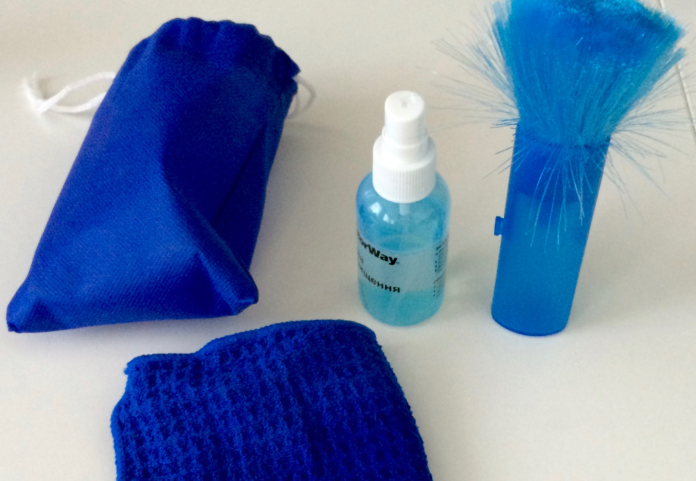

### Телевизор
Экран телевизора можно протирать только специальной тряпочкой и чистящим средством, которые находятся в ящике под телевизором.

* Собрать кисточкой пыль
* Слегка побрызгать средством из баллончика на синюю салфетку
* Протереть салфеткой пыль или другие загрязнения, которые не получилось удалить кисточкой
* Протереть сухой частью салфетки для удаления следов от средства

Чтобы не поцарапать экран телевизора:
* Нельзя пользоваться обычными моющими средсвами
* Нельзя протирать обычными салфетками или губками

